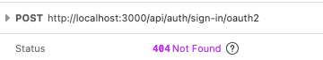
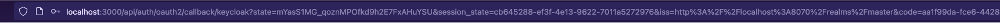

## Getting Started

First, run the development server:

```bash
npm run dev
# or
yarn dev
# or
pnpm dev
# or
bun dev
```

Open [http://localhost:3000](http://localhost:3000) with your browser to see the result.

Next run keycloak

```bash
docker compose up
```

The precreated user name is `admin` and password is `pw`

### Issue

If `basePath` is set in next.config, then the `basePath` needs to also be set in authClient. Otherwise the authClient will attempt to reach on the default `/api/auth` and it will get a 404 Not Found.



Once `basePath` is added in both places, the auth flow will prompt you to login. Once you log in the callback url will still point to the default basePath. You will be redirected to something like this: `/api/auth/oauth2/callback/keycloak...` without any base path.



If you change the basePath in the server side auth config to `/basePath/api/auth`, then the client will receive 404 Not Found when accessing any api auth route. Keycloak is not even reached in this case.

#### Baseline without base path
[View the repository before basepath changes](https://github.com/BobanL/better-auth-base-path/tree/8487de8f7b529424cb74dd1a4ab24101e7775282)

<video controls src="assets/baseline.mp4" title="Title"></video>